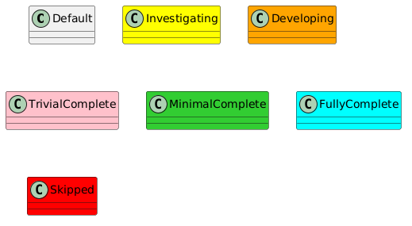

[](https://github.com/fastrobotics/crawler_app/actions/workflows/build-test.yml)

# Crawler App

- [Crawler App](#crawler-app)
  - [Overview](#overview)
- [Architecture](#architecture)
- [System Design](#system-design)
- [Troubleshooting](#troubleshooting)
- [Features](#features)
- [Setup](#setup)
- [Build](#build)
  - [Other Devices](#other-devices)
  - [Host (Plus Testing)](#host-plus-testing)
- [Generate Code Coverage (after running Host Build and Unit Tests)](#generate-code-coverage-after-running-host-build-and-unit-tests)
- [Software Sync](#software-sync)
- [Execution](#execution)
- [Device Support](#device-support)


## Overview
This repo serves as a template for a typical development app that uses eROS content.

# Architecture


# System Design
[System Design](doc/SystemDesign/SystemDesign.md)

# Troubleshooting
[Troubleshooting](doc/Troubleshooting/Troubleshooting.md)


# Features
| Status | Feature |
| ------ | ------- |

# Setup

Pre-Requisites:

- Ubuntu system running 20.04 LTS

1. Clone this repo using:
```bash
git clone --recurse-submodules https://github.com/fastrobotics/crawler_app.git
cd crawler_app
git submodule update --remote
```
2. Run the following:

```bash
cd <repo>
./scripts/setup_ide.sh
./scripts/setup_robot.sh
pre-commit install
```

# Build
| Build Flags         | Description                                 | Usage                                         |
| ------------------- | ------------------------------------------- | --------------------------------------------- |
| `BUILD_TESTING`     | Enable(Default)/Disable Testing             | `colcon ... --cmake-args -DBUILD_TESTING=OFF` |
| `CMAKE CLEAN CACHE` | Clean Cache (Default=Off) and repull repo's | `colcon ... -cmake-clean-cache`               |

## Other Devices
For other Device Build information, see:
| Device       | Build Instructions                                                       |
| ------------ | ------------------------------------------------------------------------ |
| Raspberry Pi | [Build Instructions](doc/DeviceSupport/RaspberriPi/BuildInstructions.md) |

## Host (Plus Testing)
To build on the host, run the following:
```bash
cd <workspace>
```

# Generate Code Coverage (after running [Host Build and Unit Tests](#host-plus-testing))

```bash
cd <repo>
source repo_config
./dev_tools/scripts/dev_tools.sh code_coverage
```

# Software Sync
To sync software to other devices, run the following:

```bash
cd ~/ros2_ws/src/crawler_app
./scripts/sync/syncSoftware.py -s remote -d ControlModule1 -c robot_config
./scripts/sync/syncSoftware.py -s remote -d GPUModule1 -c robot_config
```

Note that after this, you will need to build the content on that device.  See [Build-Other Devices](#other-devices).

# Execution
To launch the main content, run the following (after following [Build](#build)).  Do this for every device required:
- `ControlModule1`
- `DevComputer2`
- `GPUModule1`
    
```bash
cd <workspace>
source install/setup.bash
ros2 launch crawler_app orchestrator.launch.py robot_namespace:=robot
```

# Device Support
[Device Support](doc/DeviceSupport/DeviceSupport.md)