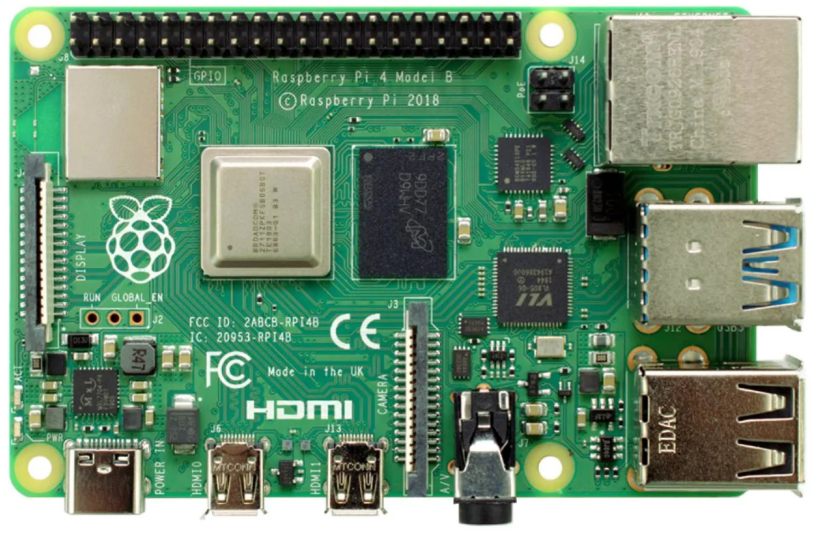

[Device Support](../DeviceSupport.md)

- [Raspberry Pi](#raspberry-pi)
- [Raspberry Pi Model Support](#raspberry-pi-model-support)
- [Device Information](#device-information)
- [Guides](#guides)
- [Command Reference](#command-reference)
  - [What version of Raspberry Pi is it](#what-version-of-raspberry-pi-is-it)
  - [OS Information](#os-information)
  - [Serial Number](#serial-number)
  - [Network Scan](#network-scan)
  - [Get Architecture](#get-architecture)

# Raspberry Pi
# Raspberry Pi Model Support
This guide currently supports the following Raspberry Pi Models:
| Model                  |
| ---------------------- |
| Raspberry Pi 4 Model B |

# Device Information 
| Hostname       | Model Information              | Architecture | IP Address    | OS          | Serial Number    |
| -------------- | ------------------------------ | ------------ | ------------- | ----------- | ---------------- |
| ComputeModule1 | Raspberry Pi 4 Model B Rev 1.5 | `armv7l`     | 192.168.86.40 | Raspbian 10 | 10000000359457da |

# Guides
| Guide                                      |
| ------------------------------------------ |
| [Image Management](ImageManagement.md)     |
| [Build Instructions](BuildInstructions.md) |
| [Auto Launch](AutoLaunch.md)               |

# Command Reference
## What version of Raspberry Pi is it
`cat /sys/firmware/devicetree/base/model`

## OS Information
`lsb_release -a`

## Serial Number
`cat /proc/cpuinfo | grep Serial`

## Network Scan
`nmap -sP 192.168.86.0/23`

## Get Architecture
`uname -m`