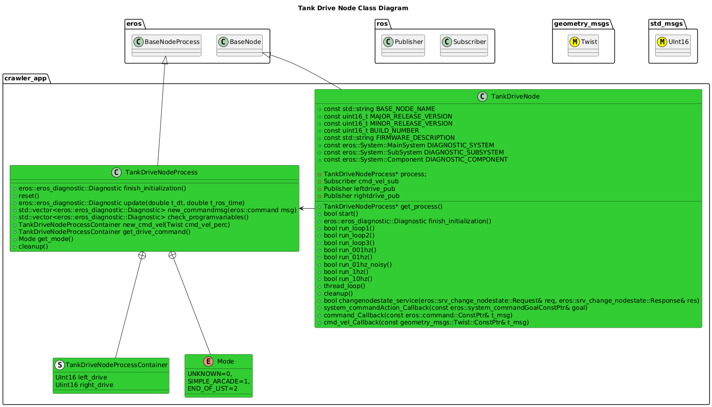
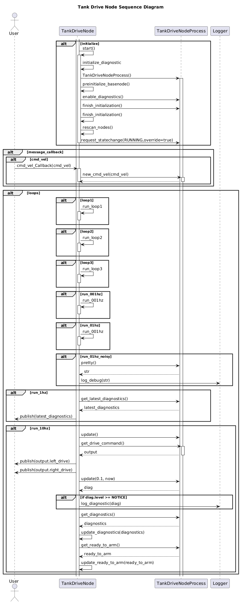

# Tank Drive
The Crawler Drive-Train consists of 2 tracks.  Therefore we need software to drive them.

## How It Works
The Tank Drive Node receives as an input the ROS message "/cmd_vel_perc" of type "geometry_msgs/Twist".  The node reads these messages and then publishes 2 channels: left and right to control the drive train.

Note that the Tank Drive Node will only publish a non-default value for left and right drive channels when the Robot is ARMED.

## Setup Instructions


## Usage Instructions
### Tank Drive Node

#### Configuration
Provide a configuration yaml for Left and Drive Channels.
Samples:
```yaml
"minimum": 1000
"neutral": 1500
"maximum": 2000
```

## Software Design

### Class Diagrams


### Sequence Diagrams


# Troubleshooting


# References
