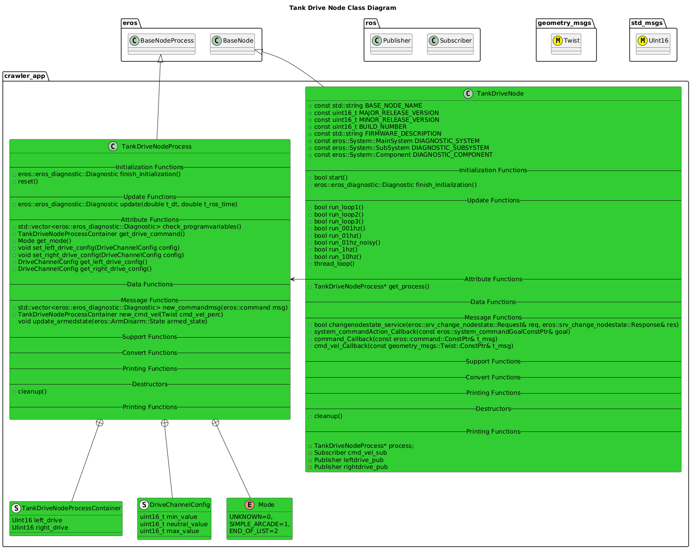

# Tank Drive
The Crawler Drive-Train consists of 2 tracks.  Therefore we need software to drive them.

## How It Works
The Tank Drive Node receives as an input the ROS message "/cmd_vel_perc" of type "geometry_msgs/Twist".

## Setup Instructions

## Usage Instructions
### Tank Drive Node

#### Configuration

### Other Tools

## Software Design

### Class Diagrams

### Sequence Diagrams

# Troubleshooting

# References
