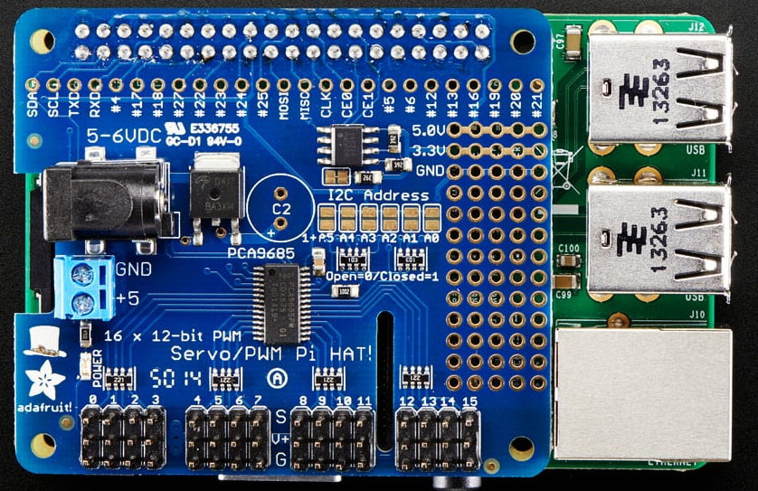

[System Design](../SystemDesign.md)
- [Compute Design](#compute-design)
- [Devices](#devices)
  - [Device: Raspberry Pi 4](#device-raspberry-pi-4)
  - [Device: Servo Hat](#device-servo-hat)
  - [Device: Propeller P2 Edge](#device-propeller-p2-edge)
  - [Device: Propeller P2 Edge Breakout](#device-propeller-p2-edge-breakout)
  - [Device: Sonar Connect Breakout](#device-sonar-connect-breakout)

# Compute Design
| Device                                                          |
| --------------------------------------------------------------- |
| [Raspberry Pi 4-`Compute Module 1`](#device-servo-hat)          |
| [Servo Hat](#device-servo-hat)                                  |
| [Propeller 2 Edge](#device-propeller-p2-edge)                   |
| [Propeller 2 Edge Breakout](#device-propeller-p2-edge-breakout) |
| [Sonar Connect Breakout](#device-sonar-connect-breakout)        |  |

# Devices
## Device: Raspberry Pi 4
Hostname: `ComputeModule1`
Support: [Device Support-Raspberry Pi](../../DeviceSupport/RaspberriPi/RaspberryPi.md) 

## Device: Servo Hat
Adafruit Servo/PWM Pi Hat

[User Guide](artifacts/AdafruitPWMServoHat/Adafruit16ChannelPWMServoHat.pdf)

[More Information](https://learn.adafruit.com/adafruit-16-channel-pwm-servo-hat-for-raspberry-pi?view=all)

## Device: Propeller P2 Edge

## Device: Propeller P2 Edge Breakout

## Device: Sonar Connect Breakout
Propeller 2 Edge Breakout Sonar Connect Rev0