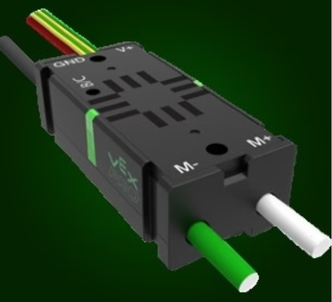
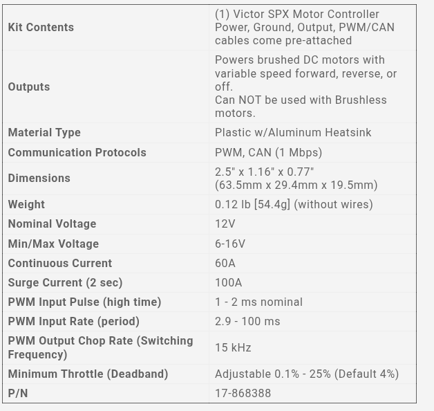
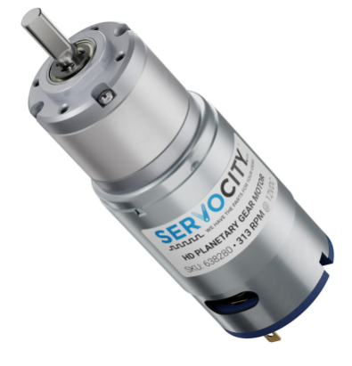

[System Design](../SystemDesign.md)

# Electrical Design

| Devices                                                            |
| ------------------------------------------------------------------ |
| [Victor SPX Motor Controller](#device-victor-spx-motor-controller) |
| [Drive Motor](#device-planetary-gear-motor)                        |

# Power Circut Design
[Power Design Calculations](PowerDesign.ods)

Left Channel: Blue
Right Channel: Yellow

# Devices
## Device: Victor SPX Motor Controller

[More Information](https://store.ctr-electronics.com/products/victor-spx?srsltid=AfmBOoq1ys8a-BGCYbYM80h0YJBe4jCUB9ud-m6-mPrQh6lsiroGrL3J)

## Device: Planetary Gear Motor
Model: Actobotics 313 RPM HD Premium Planetary Gear Motor

[Spec Sheet](artifacts/Actobotics313RPMMotor/Actobotics313RPMMotorSpecSheet.pdf)

[More Information](https://www.servocity.com/313-rpm-hd-premium-planetary-gear-motor/)