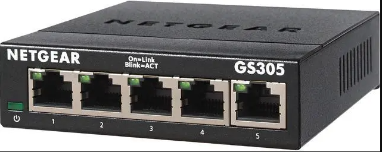

[System Design](../SystemDesign.md)

- [Network Design](#network-design)
  - [Device: Network Switch](#device-network-switch)
  - [Device: WiFi Router](#device-wifi-router)

# Network Design

| Devices                                                                     | IP Address    |
| --------------------------------------------------------------------------- | ------------- |
| [Network Switch (Netgear GS305)](#device-network-switch)                    | N/A           |
| [Onboard WiFi Router](#device-wifi-router)                                  | 192.168.86.50 |
| [`ComputeModule1`](../ComputeDesign/ComputeDesign.md#device-raspberry-pi-4) | 192.168.86.40 |

## Device: Network Switch
Model: Netgear GS305

[Datasheet](artifacts/NetgearGS305/NetgearGS305Datasheet.pdf)

## Device: WiFi Router
Model: TP-Link  TL-WR902AC 

[User Guide](artifacts/TPLinkWR902AC/TPLink_TLWR902AC-UserGuide.pdf)